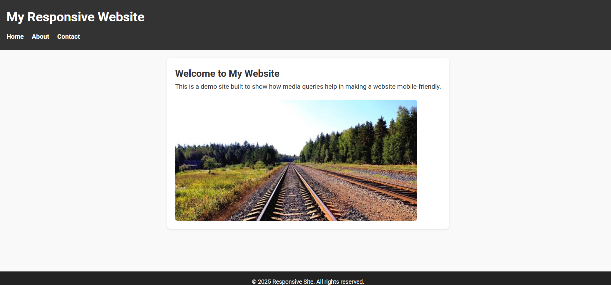

# Responsive Website Demo

A simple responsive website built to demonstrate how CSS media queries make a webpage mobile-friendly. This project features a clean layout, a responsive navigation menu with a toggle button on mobile, and fluid images that scale on different screen sizes.

## Features

- Desktop-first design with flexible layout
- Mobile-friendly navigation menu with toggle button
- Fluid images that scale within containers
- Responsive typography and spacing adjustments
- No sidebar — focus on content readability

## Screenshot




## How to Run

1. Clone the repository:

   ```bash
   git clone https://github.com/yourusername/responsive-website.git
